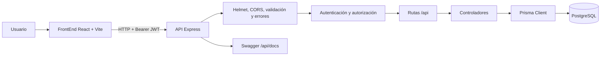
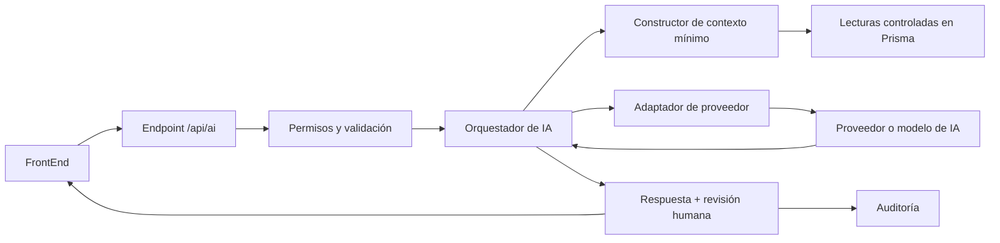

# Arquitectura de ARS Futuro

## Propósito

ARS Futuro es un sistema web para la gestión de afiliados, proveedores, planes, pólizas, autorizaciones, reclamos, servicios médicos, pagos, facturas y notificaciones de una Administradora de Riesgos de Salud.

El sistema está organizado como una aplicación cliente-servidor:

- `FrontEnd/`: cliente web en React, TypeScript y Vite.
- `backend/`: API REST en Express 5 y TypeScript.
- PostgreSQL: base de datos relacional administrada mediante Prisma.

## Arquitectura actual



### FrontEnd

`FrontEnd/src/App.tsx` funciona como shell de la aplicación y coordina autenticación, navegación, carga de recursos, formularios y dashboard. El acceso HTTP se concentra en `FrontEnd/src/api/client.ts`, mientras que `FrontEnd/src/api/adapters.ts` transforma los nombres y estructuras de la API a los modelos presentados en español.

Responsabilidades principales:

- Presentar la interfaz y el estado de la sesión.
- Enviar peticiones mediante el cliente API.
- Adaptar payloads y respuestas para la interfaz.
- Mostrar estados de carga, errores y notificaciones.
- No contener secretos ni reglas de negocio críticas.

### Backend

`backend/src/app.ts` configura Express, seguridad HTTP, CORS, JSON, health check, Swagger y manejo de errores. Las rutas se montan bajo `/api` desde `backend/src/routes/index.ts`.

El flujo de una solicitud es:

1. Express recibe la solicitud.
2. El middleware de autenticación verifica el JWT cuando corresponde.
3. El middleware de roles comprueba los permisos del usuario.
4. Zod valida parámetros, cuerpo y datos de entrada.
5. El controlador ejecuta la operación o delega en la lógica de negocio.
6. Prisma consulta o modifica PostgreSQL.
7. El middleware de errores normaliza la respuesta ante fallos.

Los controladores y servicios deben ser los únicos lugares donde se ejecuten reglas de negocio. La interfaz no debe decidir permisos, coberturas, importes ni estados definitivos.

### Persistencia

El modelo de datos se define en `backend/prisma/schema.prisma`. Las entidades principales son:

- Usuarios y notificaciones.
- Planes, pólizas y afiliados.
- Proveedores, autorizaciones y reclamos.
- Servicios médicos, pagos e invoices.

Prisma es la frontera de acceso a datos. Las consultas deben respetar las relaciones existentes y evitar devolver información innecesaria.

## Seguridad y datos sensibles

- El frontend recibe tokens, pero las claves secretas permanecen exclusivamente en el backend.
- Las rutas protegidas requieren `Authorization: Bearer <token>`.
- Las validaciones de entrada se realizan en el backend aunque exista validación equivalente en el frontend.
- Los datos personales y de salud deben tratarse como sensibles: limitar su exposición, evitar logs con payloads completos y aplicar el principio de mínimo privilegio.
- Los cambios de estado importantes deben pasar por endpoints de negocio explícitos, no por actualizaciones CRUD genéricas.

## Dirección de arquitectura para IA

La IA debe incorporarse como una capacidad del backend, no como una llamada directa desde React hacia un proveedor externo.



### Principios para la integración

1. **Backend como frontera:** las credenciales, prompts, políticas y llamadas a proveedores viven en `backend/`.
2. **Permisos antes de contexto:** verificar identidad y rol antes de consultar datos para la IA.
3. **Contexto mínimo:** enviar solo los campos necesarios, preferentemente con identificadores anonimizados o resumidos.
4. **Salida estructurada:** validar la respuesta del modelo con Zod antes de usarla.
5. **IA asistiva primero:** iniciar con explicaciones, búsquedas guiadas, resúmenes y detección de posibles inconsistencias.
6. **Humano en el circuito:** la IA no aprueba, rechaza, paga ni suspende por sí sola.
7. **Trazabilidad:** guardar auditoría de la solicitud, versión del prompt, modelo, resultado y decisión final del usuario.
8. **Tolerancia a fallos:** definir timeout, reintentos limitados, respuesta alternativa y límites de costo.
9. **Proveedor intercambiable:** encapsular el SDK externo detrás de una interfaz propia.

### Casos de uso recomendados por etapas

#### Etapa 1: bajo riesgo

- Asistente para consultar métricas y recursos autorizados.
- Resumen de un reclamo o una autorización para el personal.
- Explicación de por qué una solicitud cumple o no cumple reglas ya definidas por el backend.
- Búsqueda semántica sobre documentación interna no sensible.

#### Etapa 2: apoyo operativo

- Detección de reclamos o pagos potencialmente duplicados.
- Priorización de casos para revisión humana.
- Generación de borradores de notificaciones, siempre editables antes de enviarse.
- Identificación de datos incompletos o inconsistentes.

#### Etapa 3: automatización controlada

- Flujos automáticos únicamente para tareas reversibles y de bajo impacto.
- Las acciones sobre autorizaciones, reclamos, pagos y pólizas deben conservar aprobación humana y registro de auditoría.

## Diseño técnico sugerido para la primera implementación

Una primera versión puede añadir estos módulos sin alterar el CRUD existente:

```text
backend/src/
├── controllers/ai.controller.ts
├── routes/ai.routes.ts
├── services/ai/
│   ├── ai.service.ts          # casos de uso y orquestación
│   ├── provider.ts             # interfaz común de proveedor
│   ├── provider.mock.ts        # pruebas locales y deterministas
│   ├── context.builder.ts      # contexto mínimo y autorizado
│   └── output.schemas.ts       # respuestas Zod
└── lib/ai.config.ts            # configuración y límites
```

Antes de conectar un proveedor real, conviene implementar un proveedor mock y pruebas para:

- Rechazar solicitudes sin autenticación o rol permitido.
- Evitar que el contexto incluya campos no autorizados.
- Validar respuestas incompletas o malformadas.
- Aplicar timeout y fallback.
- Registrar auditoría sin guardar secretos o prompts con datos sensibles innecesarios.

## Decisiones y límites

- La API REST sigue siendo el contrato entre cliente y servidor.
- PostgreSQL continúa siendo la fuente de verdad para estados y reglas transaccionales.
- La IA no reemplaza las reglas deterministas del dominio.
- No se recomienda introducir un vector store o un agente autónomo antes de tener un caso de uso, una política de datos y métricas de evaluación definidos.
- Los cambios estructurales del esquema deben acompañarse de `prisma:generate`, actualización de pruebas y documentación.

## Documentación relacionada

- [README general](README.md)
- [Guía del backend](backend/README.md)
- [Guía del FrontEnd](FrontEnd/README.md)
- [Guía de agentes](AGENTS.md)
- [Diagramas UML](docs/DIAGRAMAS_UML.md)
