# Diagramas de Realización de Casos de Uso — ARS Futuro

Este dossier reúne los diagramas UML clave del proyecto para describir cómo se realizan los casos de uso en el sistema: Casos de uso, Clases, Secuencias y Actividades. Los diagramas están expresados en Mermaid para facilitar su visualización en Markdown.

## Alcance y Actores
- Actores principales: Administrador, Agente, Supervisor
- Entidades clave: Afiliado, Autorización, Reclamo, Proveedor, Póliza, Plan
- Servicios/Componentes: Frontend (React), API Backend, Sistema de Notificaciones

---

## Diagrama de Casos de Uso
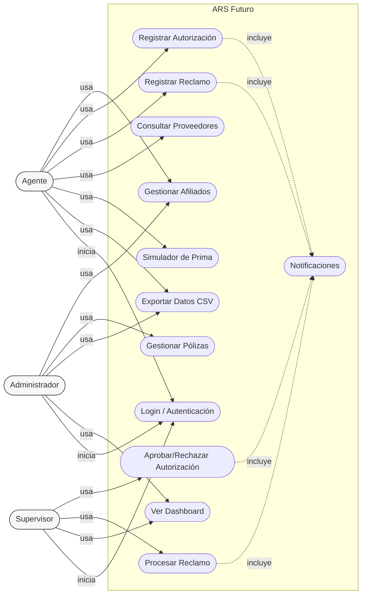

### Diagrama de Casos de Uso (Versión solicitada — Sistema de Seguro de Salud)
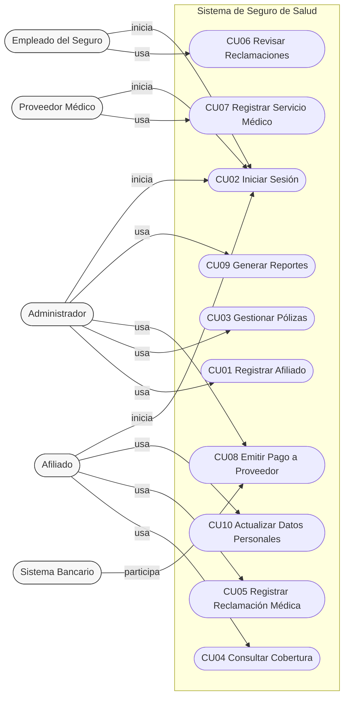

---

## Diagrama de Clases del Dominio
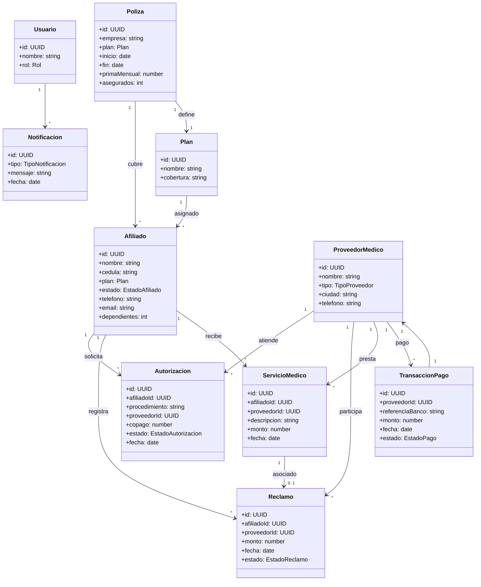

---

## Diagramas de Secuencia

### CU07 Registrar Servicio Médico
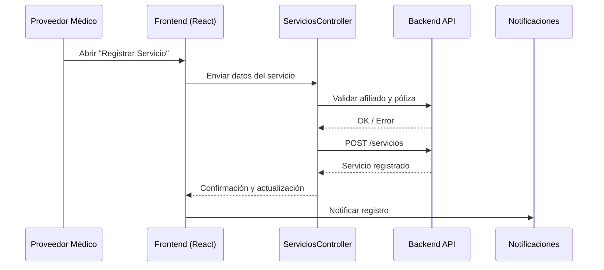

### CU08 Emitir Pago a Proveedor
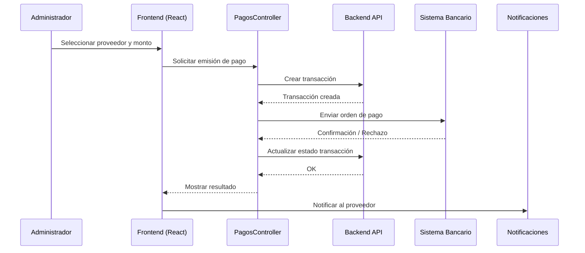

### CU06 Revisar Reclamaciones
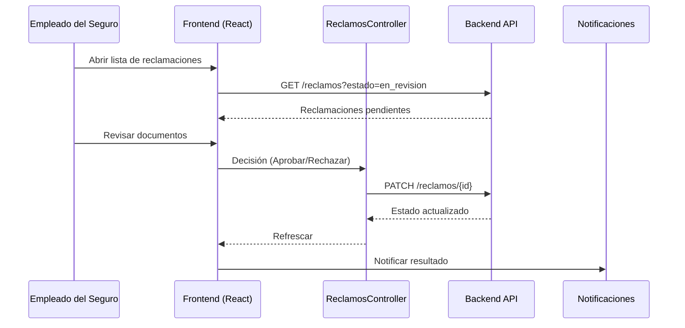

### CU04 Consultar Cobertura
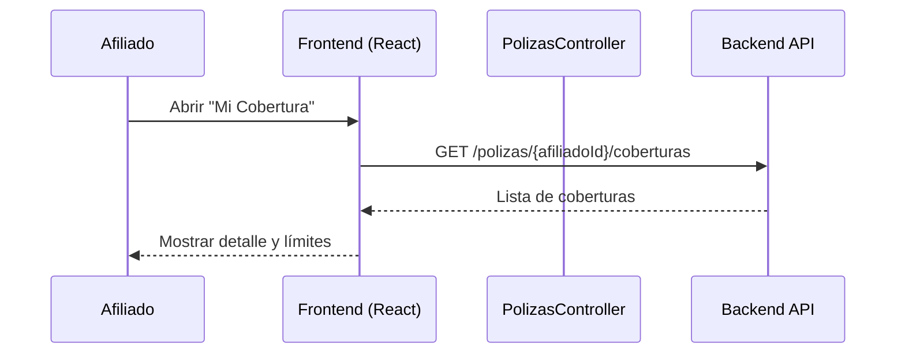

### CU10 Actualizar Datos Personales
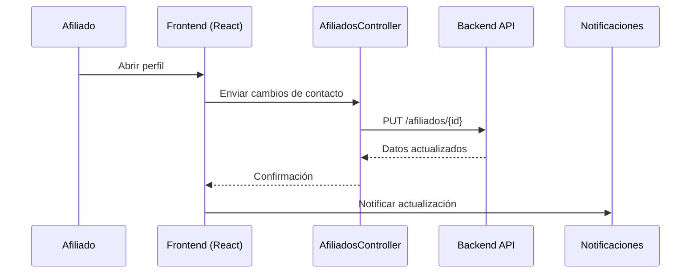

---

## Diagramas de Actividades

### Flujo: Crear Autorización
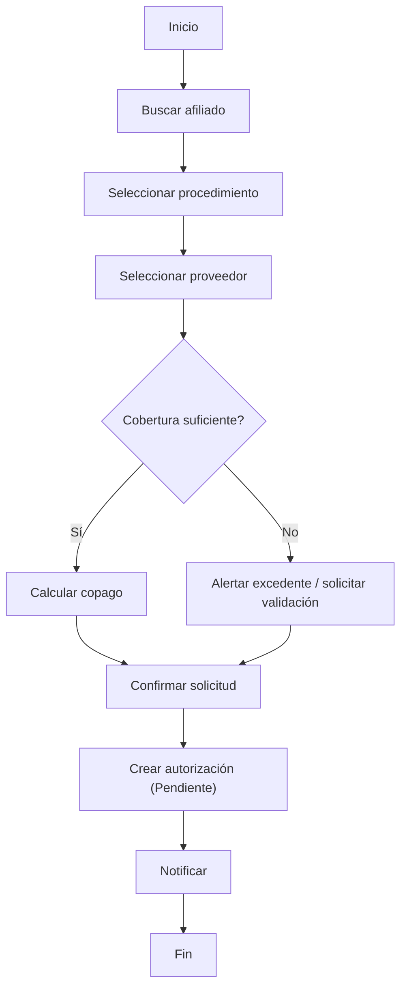

### Flujo: Procesar Reclamo
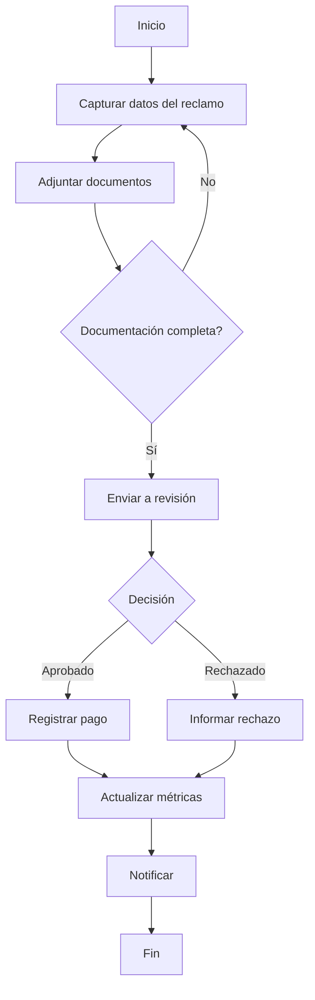

### Flujo: Gestionar Afiliado
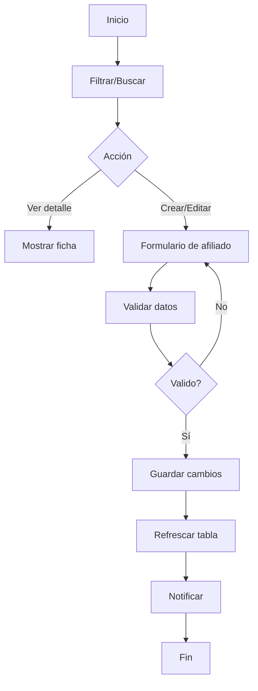

### Flujo: Consultar Proveedores
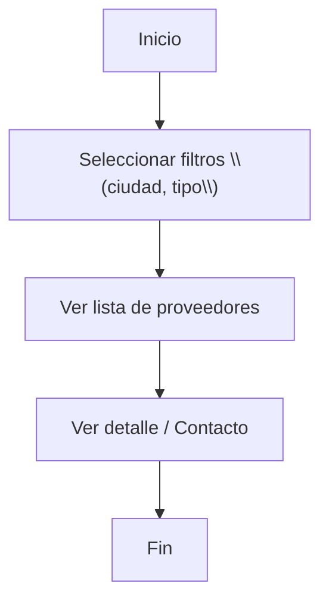
### Diagramas de Actividades (Versión solicitada — Sistema de Seguro de Salud)
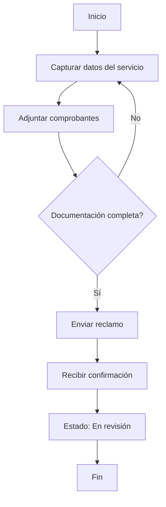

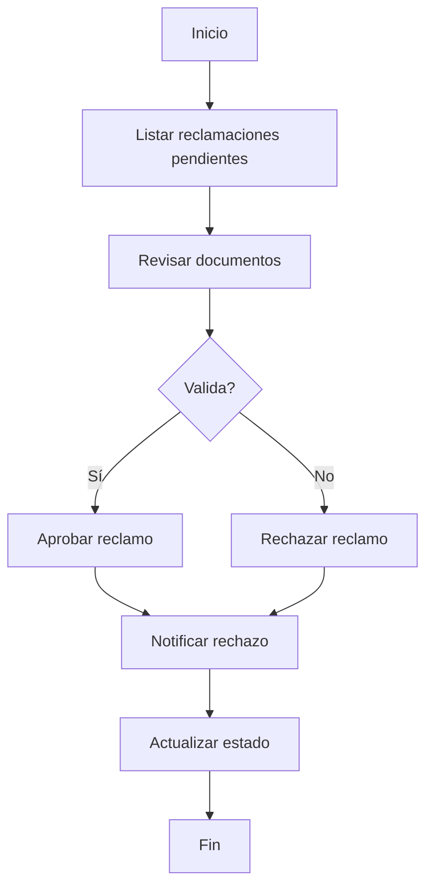

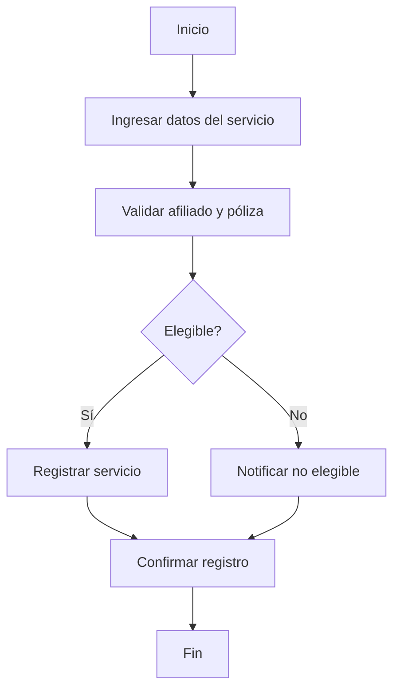

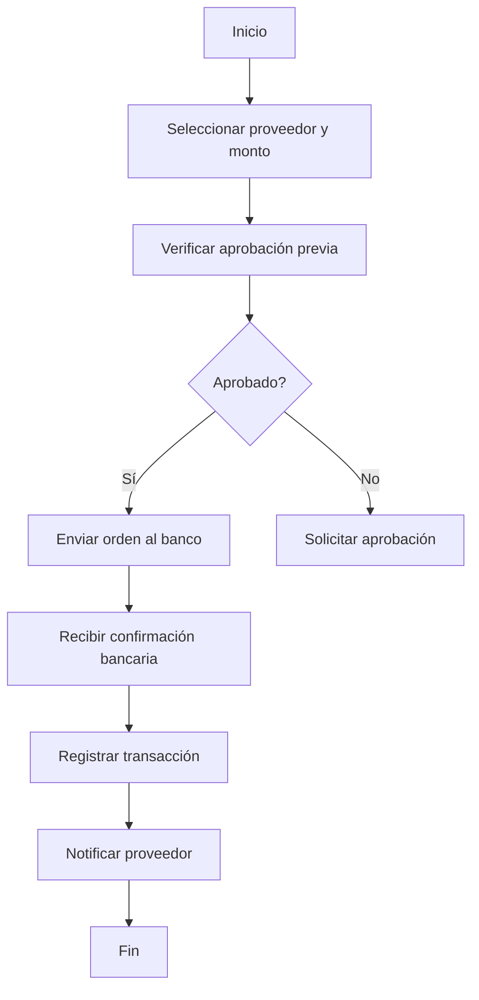

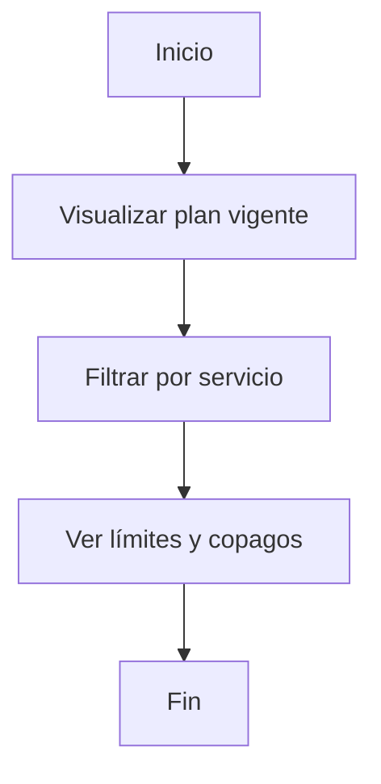

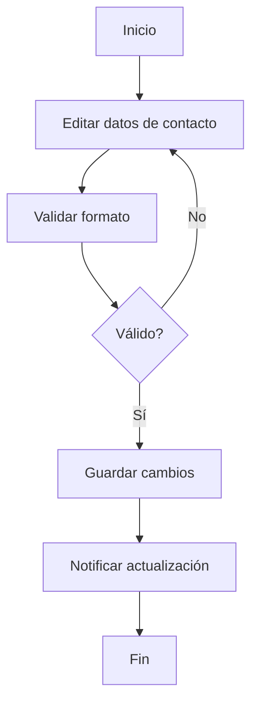

---

## Notas
- Estos diagramas se basan en las funcionalidades presentes en la aplicación (Afiliados, Autorizaciones, Reclamos, Proveedores, Pólizas, Dashboard y Notificaciones).
- Se pueden ampliar para cubrir integraciones específicas con APIs o cambios futuros de arquitectura.
- Para visualizar Mermaid en Markdown puedes usar extensiones de VS Code o ver el archivo en GitHub.